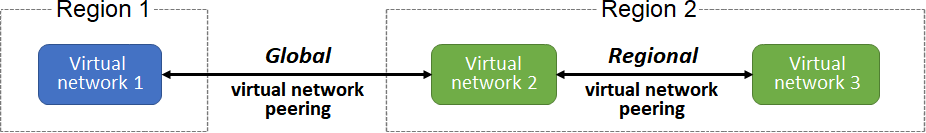
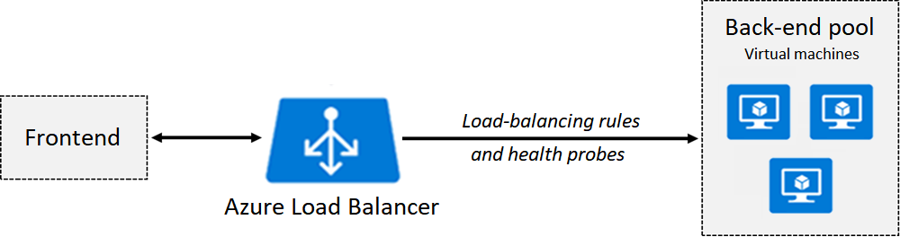

# Microsoft Azure

Microsoft Azure is a cloud computing service created by Microsoft for building, testing, deploying, and managing applications and services

## Table of Contents

- [Microsoft Azure](#microsoft-azure)
  - [Table of Contents](#table-of-contents)
  - [Azure Services](#azure-services)
  - [Azure Identity](#azure-identity)
    - [Microsoft Entra ID](#microsoft-entra-id)
      - [Microsoft Entra Tenants](#microsoft-entra-tenants)
      - [Microsoft Entra Schema](#microsoft-entra-schema)
      - [Microsoft Entra ID vs Active Directory Domain Services (AD DS)](#microsoft-entra-id-vs-active-directory-domain-services-ad-ds)
      - [Microsoft Entra ID P1 and P2 Plans](#microsoft-entra-id-p1-and-p2-plans)
      - [Microsoft Entra Domain Services (Azure AD DS)](#microsoft-entra-domain-services-azure-ad-ds)
      - [User Accounts](#user-accounts)
  - [Subscriptions](#subscriptions)
    - [Cost Management](#cost-management)
    - [Resource Tags](#resource-tags)
  - [Azure Policy](#azure-policy)
    - [Management Groups](#management-groups)
      - [Create Azure Policies](#create-azure-policies)
      - [Create Policy Definitions](#create-policy-definitions)
      - [Create Initiative Definition](#create-initiative-definition)
  - [Regions](#regions)
    - [Services with Region Pairing](#services-with-region-pairing)
  - [RBAC](#rbac)
    - [Create a role assignment:](#create-a-role-assignment)
  - [Azure Virtual Networks](#azure-virtual-networks)
    - [Subnets](#subnets)
    - [Static IP Addresses](#static-ip-addresses)
    - [Network Security Groups](#network-security-groups)
    - [Virtual Network Peering](#virtual-network-peering)
    - [VPN Gateway](#vpn-gateway)
    - [User Defined Routes (UDR)](#user-defined-routes-udr)
    - [Service Endpoints](#service-endpoints)
    - [Azure Private Link](#azure-private-link)
  - [Azure Load Balancer](#azure-load-balancer)
    - [Application Gateway](#application-gateway)
      - [Application Gateway Routing](#application-gateway-routing)
    - [Application Gateway Components](#application-gateway-components)
    - [Azure DNS](#azure-dns)
  - [Azure Storage](#azure-storage)
    - [Storage Account Types](#storage-account-types)
    - [Replication Strategies](#replication-strategies)
    - [Access Storage](#access-storage)
    - [Azure Blob Storage](#azure-blob-storage)
    - [Azure Storage Security](#azure-storage-security)
      - [Shared Access Signatures (SAS)](#shared-access-signatures-sas)
      - [Azure Storage Encryption](#azure-storage-encryption)
      - [Customer Managed Keys](#customer-managed-keys)
      - [Azure Files](#azure-files)
      - [Azure File Sync](#azure-file-sync)
      - [Azure Storage Explorer](#azure-storage-explorer)

## Azure Services

Azure offers a wide range of cloud services, including:

- **Compute**: Virtual Machines, Kubernetes, Azure Functions
- **Storage**: Blob Storage, File Storage, Disk Storage
- **Networking**: Virtual Network, Load Balancer, VPN Gateway
- **Databases**: Azure SQL Database, Cosmos DB, MySQL
- **Web and Mobile**: App Service, API Management, Notification Hubs
- **Containers**: Azure Kubernetes Service, Azure Container Instances
- **AI and Machine Learning**: Azure Machine Learning, Cognitive Services
- **IoT**: IoT Hub, IoT Central, Time Series Insights
- **Analytics**: Azure Synapse Analytics, HDInsight, Data Lake Analytics
- **Security**: Azure Active Directory, Key Vault, Security Center
- **DevOps**: Azure DevOps, Azure Pipelines, Azure Artifacts
- **Monitoring and Management**: Azure Monitor, Log Analytics, Application Insights
- **Integration**: Logic Apps, Service Bus, Event Grid
- **Blockchain**: Azure Blockchain Service, Azure Blockchain Workbench
- **Mixed Reality**: Azure Spatial Anchors, Remote Rendering, Object Anchors
- **Migration**: Azure Migrate, Azure Site Recovery, Database Migration Service
- **Storage**: Azure Storage, Azure Backup, Azure File Sync
- **Developer Tools**: Visual Studio, Visual Studio Code, GitHub
- **Identity**: Azure Active Directory, Azure AD B2C, Azure AD Domain Services

## Azure Identity

### Microsoft Entra ID

Microsoft Entra ID is a unified identity platform that provides secure access to Microsoft services and applications. It allows users to sign in to Microsoft services with a single account.

Provides more secure access to cloud-based resources for organizations and users by:

- Configuring access to applications
- Configuring single sign-on (SSO) to cloud-based SaaS applications
- Managing users and groups
- Provisioning users
- Enabling federation between organizations
- Providing an identity management solution
- Identifying irregular sign-in activity
- Configuring multi-factor authentication (MFA)
- Extending existing on-premises Active Directory implementations to Microsoft Entra ID
- Configuring Application Proxy for cloud and local applications
- Configuring Conditional Access for users and devices

#### Microsoft Entra Tenants

Tenant is a dedicated and trusted instance of Microsoft Entra that is automatically created when an organization signs up for a Microsoft cloud service subscription, such as Microsoft 365, Azure, or Dynamics 365.

- Each Microsoft Entra tenant is distinct and separate from other tenants.
- Each tenant is assigned the default Domain Name System (DNS) name of `*.onmicrosoft.com`.
- The tenant serves as the security boundary and a container for Microsoft Entra objects, such as users, groups, and apps.
- Single tenant can support multiple Azure subscriptions.

#### Microsoft Entra Schema

The Microsoft Entra schema defines the structure of objects that can be stored in Microsoft Entra, such as users, groups, and applications.

- The schema is defined by the Microsoft Entra Graph API.
- The schema is extensible, allowing developers to define custom attributes and objects.
- The schema is hierarchical, with objects organized into a tree structure.
- The schema is based on the Lightweight Directory Access Protocol (LDAP) standard.

#### Microsoft Entra ID vs Active Directory Domain Services (AD DS)

| Feature | Microsoft Entra ID | Active Directory Domain Services (AD DS) |
| --- | --- | --- |
| Identity Type | Cloud-based | On-premises |
| Authentication | Supports modern authentication protocols (OAuth, OpenID Connect) | Supports legacy authentication protocols (NTLM, Kerberos) |
| Federation | Supports federation with external identity providers (SAML, WS-Federation) | Supports federation with external identity providers (SAML, WS-Federation) |
| Multi-Factor Authentication (MFA) | Built-in support for MFA | Requires additional configuration for MFA |
| Conditional Access | Built-in support for Conditional Access policies | Requires additional configuration for Conditional Access policies |
| Application Proxy | Built-in support for Application Proxy | Requires additional configuration for Application Proxy |
| Hybrid Identity | Supports hybrid identity scenarios with on-premises AD DS | Supports hybrid identity scenarios with Azure AD Connect |
| Schema | Extensible schema with custom attributes and objects | Fixed schema with predefined attributes and objects |
| API | Microsoft Entra Graph API | Active Directory Service Interfaces (ADSI) |
| Management | Azure Portal, Microsoft 365 Admin Center | Active Directory Users and Computers (ADUC), Active Directory Administrative Center (ADAC) |

#### Microsoft Entra ID P1 and P2 Plans

Comparison Table

| Feature | P1 | P2 |
| --- | --- | --- |
| Identity Protection | No | Yes |
| Identity Governance | No | Yes |
| Privileged Identity Management | No | Yes |
| Access Reviews | No | Yes |
| Entitlement Management | No | Yes |
| Conditional Access | Yes | Yes |
| Multi-Factor Authentication (MFA) | Yes | Yes |
| Single Sign-On (SSO) | Yes | Yes |
| Application Proxy | Yes | Yes |
| Self-Service Password Reset | Yes | Yes |
| Advanced Security Reports | Yes | Yes |
| Enterprise SLA of 99.9% | Yes | Yes |
| Cloud App Discovery | Yes | Yes |

#### Microsoft Entra Domain Services (Azure AD DS)

- As part of the Microsoft Entra ID P1 or P2 tier, this service provides damin services such as Group Policy management, domain join, LDAP, and Kerberos/NTLM authentication.
- These services are fully compatible with locally deployed AD DS, so you can use them without deploying and managing additional domain controllers in the cloud.

source: <https://docs.microsoft.com/en-us/azure/active-directory-domain-services/overview>

#### User Accounts

3 types of user accounts in Microsoft Entra:

| User Account | Description |
| --- | --- |
| Cloud Identity | User account created in Microsoft Entra that is not synchronized with an on-premises directory. |
| Synced Identity | User account created in an on-premises directory and synchronized with Microsoft Entra using Azure AD Connect. |
| Federated Identity | User account created in an on-premises directory and authenticated by an on-premises identity provider using federation services. |
| Guest User | User account created in another organization and invited to access resources in your organization. |

| User Account | Description |
| --- | --- |
| Administrator | allows users elevated access to control who's allowed to do what. |
| Member | Native member of the Microsoft Entra organization that has a set of default permissions, like being able to manage their profile information. |
| Guest | have restricted Microsoft Entra organization permissions. |

## Subscriptions

Azure subscriptions are used to manage access to Azure services and resources. Each subscription has limits and quotas that can be adjusted based on your needs.

source: <https://docs.microsoft.com/en-us/azure/cost-management-billing/manage/create-subscription>

Table of subscription types with description

| Subscription Type | Description |
| --- | --- |
| Free Trial | 30-day trial subscription with $200 credit to explore Azure services. |
| Pay-As-You-Go | Pay for Azure services on a monthly basis with no long-term commitment. |
| Enterprise Agreement | Customized agreement for large organizations with volume discounts and flexible payment terms. |
| Student | Free subscription for students to learn and explore Azure services. |
| Visual Studio | Subscription for developers with access to Azure services for development and testing. |

### Cost Management

Azure Cost Management helps you understand and manage your Azure spending by providing insights into your usage and costs.

### Resource Tags

Resource tags are key-value pairs that you can assign to Azure resources to organize and categorize them for cost tracking and management.

Considerations for tagging resources:
- Use consistent naming conventions for tags.
- Use tags to track cost centers, projects, environments, and owners.
- Use tags to filter and group resources in cost reports.
- Use tags to apply policies and automation to resources.
- Use tags to track compliance and security requirements.
- Use tags to track resource lifecycle and ownership.
- Use tags to track resource dependencies and relationships.
- Use tags to track resource performance and usage.
- Use tags to track resource location and region.

## Azure Policy

- Azure Policy is a service in Azure that you use to create, assign, and manage policies that enforce different rules and effects over your resources. For example, you can create policies that enforce resource tags, require specific regions, or limit resource types.
- You can use polices to enforce rules on resources to meet corporate compliance standards and service-level agreements (SLAs).

| Advantage | Description |
| --- | --- |
| Enforce rules and compliance | Enable built-in policies, or build custom policies for all resource types. Support real-time policy evaluation and enforcement, and periodic or on-demand compliance evaluation. |
| Apply policies at scale | Apply policies to a management group with control across your entire organization. Apply multiple policies and aggregate policy states with policy initiative. Define an exclusion scope. |
| Perform remediation | Conduct real-time remediation, and remediation on your existing resources. |
| Exercise governance | Implement governance tasks for your environment |

Things to consider when using Azure Policy:

- Deployable resources: Specify the resource types that your organization can deploy by using Azure Policy.
- Location restrictions: Restrict the locations your users can specify when deploying resources.
- Rules enforcement: Enforce compliance rules and configuration options to help manage your resources and user options.
- Inventory audits: Use Azure Policy with Azure Backup service on your VMs and run inventory audits.

### Management Groups

Azure Management Groups are containers that help you manage access, policy, and compliance for multiple subscriptions. You can use management groups to apply policies and access controls to a group of subscriptions.

source: <https://docs.microsoft.com/en-us/azure/governance/management-groups/overview>

Things to consider when using management groups:

- Consider customizing the hierarchy to reflect your organization's structure.
- Consider policy inheritance and precedence within the hierarchy.
- Consider compliance and security requirements for each management group.
- Consider cost tracking and management for each management group.

Ways to create management groups:

- Azure Portal
- PowerShell
- Azure CLI

- Management groups have a directory unique identifier (ID) and a display name. The ID is used to submit commands on the management group.
- The ID **cannot** be changed after the management group is created.

#### Create Azure Policies

source: <https://docs.microsoft.com/en-us/azure/governance/policy/overview>

**Policy Definition**: describes the compliance conditions for a resource, and the actions to complete when the conditions are met.

**Initiative Definition**: a set of policy definitions to help track your compliance state for a larger goal.

1. Create Policy definitions
2. Create Initiative definition
3. Scope the initiative definition
4. Determine compliance

#### Create Policy Definitions

Examples of policy definitions:

- Allowed virtual machine size SKUs
- Allowed locations
- Not allowed resource types
- Allowed storage account SKUs
- Allowed storage account SKUs 

#### Create Initiative Definition

Along with creating your own initiative definition, you can use built-in initiative definitions to help you get started.

Examples of built-in initiative definitions:

- Audit machines with insecure password security settings
- Configure Windows machines to run Azure Monitor Agent and associate them to a Data Collection Rule
- Configure Azure Defender to be enabled on SQL servers

## Regions

Table of regional pairs characteristics with characteristic and description columns

| Characteristic | Description |
| --- | --- |
| Physical Isolation | Each region is physically isolated from other regions to prevent data leakage and unauthorized access. |
| Data Residency | Data stored in a region stays in that region unless explicitly moved to another region. |
| Platform - Provided Resiliency | Azure provides resiliency within a region by replicating data across multiple data centers. |
| Region recovery order | In the event of a region-wide failure, recovery is prioritized based on the region recovery order. |
| Sequential Updates | Planned Azure system updates are rolled out to paired regions sequentially. Rolling updates minimizes downtime, reduce bugs, and logical failures in the rare event of a bad update. |

### Services with Region Pairing

| Service | Description | Requires Region Pairing |
| --- | --- | --- |
| Azure Traffic Manager | Distributes incoming traffic across multiple regions to improve availability and responsiveness. | Yes |
| Blob Storage | Replicates data across paired regions to ensure data durability and availability. | Yes |
| Azure SQL Database | Provides automatic failover to a paired region in the event of a region-wide failure. | Yes |
| Azure Cosmos DB | Offers multi-region writes and automatic failover to a paired region. | Yes |
| Azure Active Directory | Provides disaster recovery and business continuity by replicating data across paired regions. | Yes |
| Azure Key Vault | Replicates keys and secrets across paired regions to ensure data availability and compliance. | Yes |
| Azure Backup | Replicates backup data across paired regions to ensure data durability and availability. | Yes |

## RBAC

Role-Based Access Control (RBAC) is an authorization system that allows you to manage access to Azure resources. RBAC uses roles to define permissions, and role assignments to grant access to users, groups, and applications.

source: <https://docs.microsoft.com/en-us/azure/role-based-access-control/overview>

Examples of scenarios you can implement Azure RBAC:

- Allow one user to manage virtual machines in a subscription and another user to mange virtual networks
- Allow a database administrator group to manage SQL databases in a subscription
- Allow a user to manage all resources in a resource group, such as virtual machines, websites, and subnets
- Allow an application to access all resources in a resource group

### Create a role assignment:

1. Security Principal (who): User, group, service principal, or managed identity
2. Role Definition (what): a collection of permissions
3. Scope (where): level where the access applies

## Azure Virtual Networks

Azure Virtual Networks allow you to create isolated networks in the cloud to run your applications and services. You can control inbound and outbound traffic, and connect virtual networks to on-premises networks.

Characteristics of Azure Virtual Networks:

- logical isolation of the Azure cloud resources
- Can use virtual networks to provision and manage virtual private networks (VPNs) in Azure
- Each virtual network has its own Classless Inter-Domain Routing (CIDR) block and can be linked to other virtual networks and on-premises networks.
- You can link virtual networks with an on-premises IT infrastructure to create hybrid or cross-premises solutions, when the CIDR blocks of the connecting networks don't overlap.
- You control the DNS serer settings for virtual networks, and segmentation of the virtual network into subnets.

Scenarios of virtual network configuatrions:
table with columns Scenario, Description

| Scenario | Description |
| --- | --- |
| Create a dedicated private cloud-only virtual network | Sometimes you don't require a cross-premises configuration for your solution. When you create a virtual network, your services and virtual machines within your virtual network can communicate directly and securely with each other in the cloud. You can still configure endpoint connections for the virtual machines and services that require internet communication, as part of your solution. |
| Securely extend your data center with virtual networks | You can build traditional site-to-site VPNs to securely scale your datacenter capacity. Site-to-site VPNs use IPSEC to provide a secure connection between your corporate VPN gateway and Azure. |
| Enable hybrid cloud scenarios | Virtual networks give you the flexibility to support a range of hybrid cloud scenarios. You can securely connect cloud-based applications to any type of on-premises system, such as mainframes and Unix systems. |

### Subnets

Subnets provide a way for you to implement logical divisions within your virtual network. Your network can be segmented into subnets to help improve security, increase performance, and make it easier to manage.

Characteristics of subnets:

- Each subnet contains a range of IP addresses that fall within the virtual network address space.
- The address range for a subnet must be unique with the address space for the virtual network.
- The range for one subnet can't overlap with other subnet IP address ranges in the same virtual network.
- The IP address space for a subnet must be specified by using CIDR notation.
- You can segment a virtual network into one or more subnets in the Azure portal.

Table of reserved subnet addresses with columns Reserved Address, Reason

| Reserved Address | Reason |
| --- | --- |
| 192.168.1.0 | Network address |
| 192.168.1.1 | Azure configures this address as the default gateway. |
| 192.168.1.2 and 192.168.1.3 | Azure maps these Azure DNS IP addresses to the virtual network space. |
| 192.168.1.255 | Broadcast address |

Things to consider when using subnets:
table with columns scenario, description

| Scenario | Description |
| --- | --- |
| Service requirements | Each service directly deployed into a virtual network has specific requirements for routing and the types of traffic that must be allowed into and out of associated subnets. A service might require or create their own subnet. There must be enough unallocated space to meet the service requirements. Suppose you connect a virtual network to an on-premises network by using Azure VPN Gateway. The virtual network must have a dedicated subnet for the gateway. |
| Network virtual appliances | Azure routes network traffic between all subnets in a virtual network, by default. You can override Azure's default routing to prevent Azure routing between subnets. You can also override the default to route traffic between subnets through a network virtual appliance. If you require traffic between resources in the same virtual network to flow through a network virtual appliance, deploy the resources to different subnets. |
| Service endpoints | You can limit access to Azure resources like an Azure storage account or Azure SQL database to specific subnets with a virtual network service endpoint. You can also deny access to the resources from the internet. You might create multiple subnets, and then enable a service endpoint for some subnets, but not others. |
| Network security groups | You can associate zero or one network security group to each subnet in a virtual network. You can associate the same or a different network security group to each subnet. Each network security group contains rules that allow or deny traffic to and from sources and destinations. |
| Private links | Azure Private Link provides private connectivity from a virtual network to Azure platform as a service (PaaS), customer-owned, or Microsoft partner services. Private Link simplifies the network architecture and secures the connection between endpoints in Azure. The service eliminates data exposure to the public internet. |

source: <https://docs.microsoft.com/en-us/azure/virtual-network/virtual-networks-overview>

### Static IP Addresses

Situations for Static IP Addresses:

- DNS name resolution, where a change in the IP address requires updating host records.
- IP address-based security models that require apps or services to have a static IP address.
- TLS/SSL certificates linked to an IP address.
- Firewall rules that allow or deny traffic by using IP address ranges.
- Role-based virtual machines such as Domain Controllers and DNS servers.

### Network Security Groups

- Contains a list of security rules that allow or deny inbound or outbound network traffic.
- Can be associated to a subnet or a network interface.
- Can be associated multiple times.
- You create a network security group and define security rules in the Azure portal.

Network interface card (NIC): a virtual network adapter that provides the network connectivity for a virtual machine.

### Virtual Network Peering

Virtual network peering enables you to connect virtual networks in the same or different regions. Peering provides secure communication between resources in the peered networks.
After the networks are peered, the two virtual networks operate as one network for connectivity purposes.

Characteristics of virtual network peering:

- 2 types of Azure Virtual Network Peering: **regional** and **global**.
  
  source: <https://docs.microsoft.com/en-us/azure/virtual-network/virtual-network-peering-overview>
- Regional peering: connects Azure virtual networks that exist in the same region.
- Global peering: connects Azure virtual networks that exist in different regions.
- Global peering of virtual networks in different Azure Government cloud regions isn't permitted.
- After you create a peering between virtual networks, the individual virtual networks are still managed as separate resources.

### VPN Gateway

source: <https://docs.microsoft.com/en-us/azure/vpn-gateway/vpn-gateway-about-vpngateways>

- A virtual network can have only one VPN gateway.
- Gateway transit is supported for both regional and global peering.
- Gateway transit allows peered virtual networks to share the gateway and get access to resources. You don't need to deploy a VPN gateway in the peer virtual network.
- You can apply network security groups in a virtual network to block or allow access to other virtual networks or subnets.

### User Defined Routes (UDR)

- User-defined routes (UDR) control traffic by defining routes that specify the next hop of traffic flow.

The next hop can be one of the following:

- Virtual network gateway
- Virtual network
- Internet
- Network virtual appliance (NVA)

- Each route table can be associated to multiple subnets.
- Each subnet can be associated to one route table only.
- There are no charges for creating route tables in Azure.

### Service Endpoints

- Service endpoints provides the identity of your virtual network to the Azure service.
- Configured on a subnet.

source: <https://docs.microsoft.com/en-us/azure/virtual-network/virtual-network-service-endpoints-overview>

### Azure Private Link

- Provides private connectivity from a virtual network to Azure platform as a service (PaaS), customer-owned, or Microsoft partner services.
- Simplifies the network architecture and secures the connection between endpoints in Azure by eliminating data exposure to the public internet.

Characteristics of Azure Private Link:

- Keeps all traffic on the Microsoft global network. There is no exposure to the public internet.
- Global and there are no regional restrictions.
- Can privately deliver your own services in your customer's virtual networks.
- All traffic to the service can be routed through the private endpoint. No gateways, NAT devices, ExpressRoute, or VPN connections are needed.

source: <https://docs.microsoft.com/en-us/azure/private-link/private-link-overview>

## Azure Load Balancer

Azure Load Balancer delivers high availability and network performance to your applications. Use load balancing to efficiently distribute incoming
network traffic across back-end servers and resources. A load balancer is implemented by using load-balancing rules and health probes.

source: <https://docs.microsoft.com/en-us/azure/load-balancer/load-balancer-overview>

Characteristics of Azure Load Balancer:

- Can be used for inbound and outbound services.
- Can implement a public or internal load balancer, or both.
- Configure four components: front-end IP configuration, back-end address pool, load-balancing rules, and health probes.
- Front-end configuration specifies the public IP or internal IP that the load balancer uses.
- Back-end pools are your services and resources, such as virtual machines.
- Load-balancing rules define how traffic is distributed to the back-end pool.
- Health probes ensure the resources in the backend are healthy and can receive traffic.
- Scales up to millions of TCP and UDP flows.

### Application Gateway

Admins use Azure Application Gateway to manage requests from client applications to their web apps. An application gateway listens for incoming traffic to web apps and checks for messages sent via protocols like HTTP. Gateway rules direct traffic to resources in a back-end pool.

source: <https://docs.microsoft.com/en-us/azure/application-gateway/overview>

Benefits of Azure Application Gateway:

| Benefit | Description |
| --- | --- |
| Application layer routing | Use application layer routing to direct traffic to a back-end pool of web servers based on the URL of a request. The back-end pool can include Azure virtual machines, Azure Virtual Machine Scale Sets, Azure App Service, and even on-premises servers. |
| Round-robin load balancing | Employ round-robin load balancing to distribute incoming traffic across multiple servers. Send load-balance requests to the servers in each back-end pool. Client requests are forwarded in a cycle through a group of servers to create an effective balance for the server load. |
| Session stickiness | Apply session stickiness to your application gateway to ensure client requests in the same session are routed to the same back-end server. |
| Supported protocols | Build an application gateway to support the HTTP, HTTPS, HTTP/2, or WebSocket protocols. |
| Firewall protection | Implement a web application firewall to protect against web application vulnerabilities. |
| Encryption | Support end-to-end request encryption for your web applications. |
| Load autoscaling | Dynamically adjust capacity as your web traffic load changes. |

#### Application Gateway Routing

- 2 primary methods for routing traffic:
  - **Path-based routing**: sends requests with different URL paths to different pools of back-end servers.
  - **Multi-site routing**: configures more than one web application on the same application gateway instance.
- **Redirect traffic**: received at one listener to another listener, or to an external site. This approach is commonly used by web apps to automatically redirect HTTP requests to communicate via HTTPS. The redirection ensures all communication between your web app and clients occurs over an encrypted path.
- **Rewrite HTTP headers**: HTTP headers allow the client and server to pass parameter information with the request or the response. In this scenario, you can translate URLs or query string parameters, and modify request and response headers. Add conditions to ensure URLs or headers are rewritten only for certain conditions.
- Application Gateway allows you to create custom error pages instead of displaying default error pages. You can use your own branding and layout by using a custom error page.

Path-Based Routing:

source: <https://docs.microsoft.com/en-us/azure/application-gateway/path-based-routing-overview>

Multi-Site Routing:

source: <https://docs.microsoft.com/en-us/azure/application-gateway/multi-site-overview>

### Application Gateway Components

- **Front-end IP address**: receives requests.
- **Web-application firewall (optional)**: checks incoming traffic for common threats before the requests reach the listeners.
- **Listeners**: receive the traffic and route the requests to the back-end pool.
- **Routing rules**: define how to analyze the request to direct the request to the appropriate back-end pool.
- **Back-end pool**: contains web servers for resources like virtual machines or Virtual Machine Scale Sets. Each pool has a load balancer to distribute the workload across the resources.
- **Health probes**: monitor the health of the back-end resources. Determine which back-end pool servers are available for load-balancing.

source: <https://docs.microsoft.com/en-us/azure/application-gateway/application-gateway-components>

### Azure DNS

Azure DNS is a hosting service for Domain Name System (DNS) domains that provides name resolution by using Microsoft Azure infrastructure.

DNS, or the Domain Name System, is a protocol within the TCP/IP standard. DNS serves an essential role of translating the human-readable domain names—for example: www.wideworldimports.com—into a known IP address. IP addresses enable computers and network devices to identify and route requests among themselves.

DNS uses a global directory hosted on servers around the world. Microsoft is part of the network that provides a DNS service through Azure DNS.

A DNS server is also known as a DNS name server, or just a name server.

A DNS server carries out one of two primary functions:

- Maintains a local cache of recently accessed or used domain names and their IP addresses. This cache provides a faster response to a local domain lookup request. If the DNS server can't find the requested domain, it passes the request to another DNS server. This process repeats at each DNS server until either a match is made or the search times out.
- Maintains the key-value pair database of IP addresses and any host or subdomain over which the DNS server has authority. This function is often associated with mail, web, and other internet domain services.

Every computer, server, or network-enabled device on your network has an IP address. An IP address is unique within your domain. There are two standards of IP address: IPv4 and IPv6.

- **IPv4** is composed of four sets of numbers, in the range 0 to 255, each separated by a dot; for example: 127.0.0.1. Today, IPv4 is the most commonly used standard. Yet, with the increase in IoT devices, the IPv4 standard will eventually be unable to keep up.

- **IPv6** is a relatively new standard and is intended to eventually replace IPv4. It consists of eight groups of hexadecimal numbers, each separated by a colon; for example: fe80:11a1:ac15:e9gf:e884:edb0:ddee:fea3.

Many network devices are now provisioned with both an IPv4 and an IPv6 address. The DNS name server can resolve domain names to both IPv4 and IPv6 addresses.

## Azure Storage

### Storage Account Types

| Storage Account | Supported Services | Recommended Usage |
| --- | --- | --- |
| Standard general-purpose v2 | Blobs, Azure Files, Queue Storage, Table Storage, Disks | Most scenarios, including VMs, databases, and big data |
| Premium block blob | Blobs | High-performance, transaction-intensive workloads |
| Premium file shares | Azure Files | High-performance, transaction-intensive workloads |
| Premium page blobs | Disks | High-performance, transaction-intensive workloads |

### Replication Strategies

4 replication strategies:

- **Locally redundant storage (LRS)**: replicates your data three times in a storage scale unit in a data center. LRS is the least expensive replication option, but it does not protect your data from a data center failure.
- **Zone-redundant storage (ZRS)**: replicates your data across multiple data centers within the same region. ZRS is more expensive than LRS but less expensive than GRS or RA-GRS. ZRS protects your data from a data center failure.
- **Geo-redundant storage (GRS)**: replicates your data to a secondary region, hundreds of miles away from the primary location of the source data. GRS is more expensive than LRS or ZRS but provides a higher level of durability for your data, even if the primary region is unavailable.
- **Read-access geo-redundant storage (RA-GRS)**: provides read-only access to the data in the secondary region, in addition to Geo-redundant storage capabilities. RA-GRS is the most expensive replication option but provides the highest level of durability and availability for your data.

### Access Storage

Every object you store in Azure Storage has a unique URL address. Your storage account name forms the subdomain portion of the URL address. The combination of the subdomain and the domain name, which is specific to each service, forms an endpoint for your storage account.

Example:

table with column names service, default endpoint

| Service | Default Endpoint |
| --- | --- |
| Container service | `https://<storage-account-name>.blob.core.windows.net` |
| Table service | `https://<storage-account-name>.table.core.windows.net` |
| Queue service | `https://<storage-account-name>.queue.core.windows.net` |
| File service | `https://<storage-account-name>.file.core.windows.net` |

### Azure Blob Storage

Blob Storage is a service that stores unstructured data in the cloud as objects or blobs. Blob stands for **Binary Large Object**.

Blob Storage is also referred to as **object storage** or **container storage**.

Blob Storage can store any type of text or binary data, such as:

- Text documents
- Images
- Videos
- Application Installers

Relationship between Blob Storage and resources:

source: <https://docs.microsoft.com/en-us/azure/storage/blobs/storage-blobs-introduction>

table of blob storage access tiers with columns tier, description

| Tier | Description |
| --- | --- |
| Hot | Optimized for storing data that is accessed frequently. |
| Cool | Optimized for storing data that is infrequently accessed and stored for at least 30 days. |
| Cold | The Cold tier is also optimized for storing large amounts of data that's infrequently accessed. This tier is intended for data that can remain in the tier for at least 90 days. |
| Archive | Optimized for storing data that is rarely accessed and stored for at least 180 days. |

| Access Tier | Data Access | Data Retrieval | Data Storage |
| --- | --- | --- | --- |
| Hot | Frequent | Immediate | Higher cost |
| Cool | Infrequent | Immediate | Lower cost |
| Cold | Infrequent | Immediate | Lower cost |
| Archive | Rare | Delayed | Lowest cost |

**Different Blob Types**

| Type | Description |
| --- | --- |
| Block blobs | Optimized for streaming and storing cloud objects, such as documents, media files, or application installers. |
| Append blobs | Optimized for append operations, such as logging data from virtual machines. |
| Page blobs | Optimized for random read-write operations, such as virtual hard disk (VHD) files for Azure Virtual Machines. |

### Azure Storage Security

| Characteristic | Description |
| --- | --- |
| Data encryption | All data written to Azure Storage is automatically encrypted by using Azure Storage encryption. |
| Authentication | Microsoft Entra ID and role-based access control (RBAC) are supported for Azure Storage for both resource management operations and data operations. Assign RBAC roles scoped to an Azure storage account to security principals, and use Microsoft Entra ID to authorize resource management operations like key management. Microsoft Entra integration is supported for data operations on Azure Blob Storage and Azure Queue Storage. |
| Authorization | Every request made against a secured resource in Blob Storage, Azure Files, Queue Storage, or Azure Cosmos DB (Azure Table Storage) must be authorized. Authorization ensures that resources in your storage account are accessible only when you want them to be, and to only those users or applications whom you grant access. |
| Data in transit | Data can be secured in transit between an application and Azure by using Client-Side Encryption, HTTPS, or SMB 3.0. |
| Disk encryption | Operating system disks and data disks used by Azure Virtual Machines can be encrypted by using Azure Disk Encryption. |
| Shared access signatures | elegated access to the data objects in Azure Storage can be granted by using a shared access signature (SAS). |

**Authorization Strategies**
table with columns strategy, description

| Strategy | Description |
| --- | --- |
| Microsoft Entra ID | Microsoft Entra ID is Microsoft's cloud-based identity and access management service. With Microsoft Entra ID, you can assign fine-grained access to users, groups, or applications by using role-based access control. |
| Shared access signatures | A SAS delegates access to a particular resource in your Azure storage account with specified permissions and for a specified time interval. |
| Shared keys | Shared Key authorization relies on your Azure storage account access keys and other parameters to produce an encrypted signature string. The string is passed on the request in the Authorization header. |
| Anonymous access to containers and blobs | You can optionally make blob resources public at the container or blob level. A public container or blob is accessible to any user for anonymous read access. Read requests to public containers and blobs don't require authorization. |

#### Shared Access Signatures (SAS)

A shared access signature (SAS) is a uniform resource identifier (URI) that grants restricted access rights to Azure Storage resources. SAS is a secure way to share your storage resources without compromising your account keys.

You can provide a SAS to clients who shouldn't have access to your storage account key. By distributing a SAS URI to these clients, you grant them access to a resource for a specified period of time.

#### Azure Storage Encryption

Azure Storage encryption for data at rest protects your data by ensuring your organizational security and compliance commitments are met. The encryption and decryption processes happen automatically. Because your data is secured by default, you don't need to modify your code or applications.

- Data is encrypted automatically before it's persisted to Azure Managed Disks, Azure Blob Storage, Azure Queue Storage, Azure Cosmos DB, Azure Table Storage, or Azure Files.
- Data is automatically decrypted before it's retrieved.
- Azure Storage encryption, encryption at rest, decryption, and key management are transparent to users.
- All data written to Azure Storage is encrypted through 256-bit advanced encryption standard (AES) encryption. AES is one of the strongest block ciphers available.
- Azure Storage encryption is enabled for all new and existing storage accounts and can't be disabled.

#### Customer Managed Keys

For your Azure Storage security solution, you can use Azure Key Vault to manage your encryption keys. The Azure Key Vault APIs can be used to generate encryption keys. You can also create your own encryption keys and store them in a key vault.

- By creating your own keys (referred to as customer-managed keys), you have more flexibility and greater control.
- You can create, disable, audit, rotate, and define access controls for your encryption keys.
- Customer-managed keys can be used with Azure Storage encryption. You can use a new key or an existing key vault and key. The Azure storage account and the key vault **must be in the same region**, but they **can be in different subscriptions**.

#### Azure Files

Azure Files offers shared storage for applications by using the industry standard Server Message Block and Network File System (NFS) protocols. Azure virtual machines (VMs) and cloud services can share file data across application components by using mounted shares. On-premises applications can also access file data in the share.

- Azure Files stores data as true directory objects in file shares.
- Azure Files provides shared access to files across multiple VMs. Any number of Azure virtual machines or roles can mount and access an Azure file share simultaneously.
- Applications that run in Azure VMs or cloud services can mount an Azure file share to access file data. This process is similar to how a desktop application mounts a typical SMB share.
- Azure Files offers fully managed file shares in the cloud. Azure file shares can be mounted concurrently by cloud or on-premises deployments of Windows, Linux, and macOS.

**Azure File vs Azure Blob**
table with columns Azure File, Azure Blob

| Azure File | Azure Blob |
| --- | --- |
|Azure Files provides the SMB and NFS protocols, client libraries, and a REST interface that allows access from anywhere to stored files. | Azure Blob Storage provides client libraries and a REST interface that allows unstructured data to be stored and accessed at a massive scale in block blobs. |
| Files in an Azure Files share are true directory objects. Data in Azure Files is accessed through file shares across multiple virtual machines. | Blobs in Azure Blob Storage are a flat namespace. Blob data in Azure Blob Storage is accessed through a container. |
| Azure Files is ideal to lift and shift an application to the cloud that already uses the native file system APIs. Share data between the app and other applications running in Azure. Azure Files is a good option when you want to store development and debugging tools that need to be accessed from many virtual machines. | Azure Blob Storage is ideal for applications that need to support streaming and random-access scenarios. Azure Blob Storage is a good option when you want to be able to access application data from anywhere. |

Types of Azure file shares:
- Premium tier: stores data on modern solid-state drives (SSDs), while the standard tier uses hard disk drives (HDDs).
- Standard tier: can be used with SMB and REST protocols only, while premium file shares can be used with SMB, NFS, and REST protocols.
- You can easily switch between hot, cool, and transaction optimized tiers of standard file shares, but you can't switch from premium file shares to any of the standard tiers.

**File Share Snapshots**

- Azure Files supports file share snapshots. Snapshots are read-only versions of a file share that are created at a specific point in time.

Characteristics of file share snapshots:

- Azure Files share snapshot capability is provided at the file share level.
- Share snapshots are incremental. Only data changed since most recent share snapshot is saved.
- Incremental snapshots minimize the time required to create share snapshots and saves on storage costs.
- You only need to retain the most recent share snapshot to restore the share to its previous state.
- You can retrieve a share snapshot for an individual file.
- Share snapshots provide only file-level protection. They don't prevent fat-finger deletions on a file share or storage account. If you delete a file share that has share snapshots, all of its snapshots will be deleted along with the share.

#### Azure File Sync

Azure File Sync enables you to cache several Azure Files shares on an on-premises Windows Server or cloud virtual machine. You can use Azure File Sync to centralize your organization's file shares in Azure Files, while keeping the flexibility, performance, and compatibility of an on-premises file server.

- Azure File Sync transforms Windows Server into a quick cache of your Azure Files shares.
- You can use any protocol that's available on Windows Server to access your data locally with Azure File Sync, including SMB, NFS, and FTPS.
- Azure File Sync supports as many caches as you need around the world.

#### Azure Storage Explorer

Azure Storage Explorer is a standalone application that makes it easy to work with Azure Storage data on Windows, macOS, and Linux. With Azure Storage Explorer, you can access multiple accounts and subscriptions, and manage all your Storage content.

- Azure Storage Explorer requires both management (Azure Resource Manager) and data layer permissions to allow full access to your resources. You need Microsoft Entra ID (formerly Azure Active Directory) permissions to access your storage account, the containers in your account, and the data in the containers.