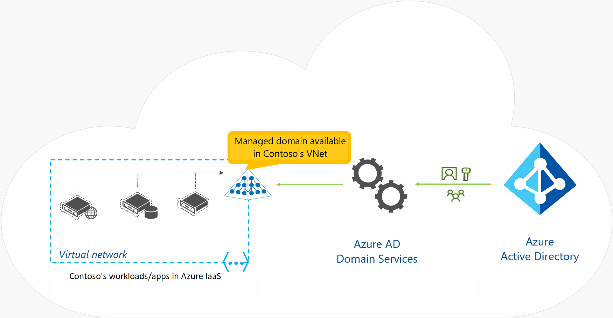

# Microsoft Azure

Microsoft Azure is a cloud computing service created by Microsoft for building, testing, deploying, and managing applications and services

## Table of Contents

- [Microsoft Azure](#microsoft-azure)
  - [Table of Contents](#table-of-contents)
  - [Azure Services](#azure-services)
  - [Azure Identity](#azure-identity)
    - [Microsoft Entra ID](#microsoft-entra-id)
      - [Microsoft Entra Tenants](#microsoft-entra-tenants)
      - [Microsoft Entra Schema](#microsoft-entra-schema)
      - [Microsoft Entra ID vs Active Directory Domain Services (AD DS)](#microsoft-entra-id-vs-active-directory-domain-services-ad-ds)
      - [Microsoft Entra ID P1 and P2 Plans](#microsoft-entra-id-p1-and-p2-plans)
      - [Microsoft Entra Domain Services (Azure AD DS)](#microsoft-entra-domain-services-azure-ad-ds)
      - [User Accounts](#user-accounts)
  - [Subscriptions](#subscriptions)
    - [Cost Management](#cost-management)
    - [Resource Tags](#resource-tags)
  - [Azure Policy](#azure-policy)
    - [Management Groups](#management-groups)
      - [Create Azure Policies](#create-azure-policies)
      - [Create Policy Definitions](#create-policy-definitions)
      - [Create Initiative Definition](#create-initiative-definition)
  - [Regions](#regions)
    - [Services with Region Pairing](#services-with-region-pairing)

## Azure Services

Azure offers a wide range of cloud services, including:

- **Compute**: Virtual Machines, Kubernetes, Azure Functions
- **Storage**: Blob Storage, File Storage, Disk Storage
- **Networking**: Virtual Network, Load Balancer, VPN Gateway
- **Databases**: Azure SQL Database, Cosmos DB, MySQL
- **Web and Mobile**: App Service, API Management, Notification Hubs
- **Containers**: Azure Kubernetes Service, Azure Container Instances
- **AI and Machine Learning**: Azure Machine Learning, Cognitive Services
- **IoT**: IoT Hub, IoT Central, Time Series Insights
- **Analytics**: Azure Synapse Analytics, HDInsight, Data Lake Analytics
- **Security**: Azure Active Directory, Key Vault, Security Center
- **DevOps**: Azure DevOps, Azure Pipelines, Azure Artifacts
- **Monitoring and Management**: Azure Monitor, Log Analytics, Application Insights
- **Integration**: Logic Apps, Service Bus, Event Grid
- **Blockchain**: Azure Blockchain Service, Azure Blockchain Workbench
- **Mixed Reality**: Azure Spatial Anchors, Remote Rendering, Object Anchors
- **Migration**: Azure Migrate, Azure Site Recovery, Database Migration Service
- **Storage**: Azure Storage, Azure Backup, Azure File Sync
- **Developer Tools**: Visual Studio, Visual Studio Code, GitHub
- **Identity**: Azure Active Directory, Azure AD B2C, Azure AD Domain Services

## Azure Identity

### Microsoft Entra ID

Microsoft Entra ID is a unified identity platform that provides secure access to Microsoft services and applications. It allows users to sign in to Microsoft services with a single account.

Provides more secure access to cloud-based resources for organizations and users by:

- Configuring access to applications
- Configuring single sign-on (SSO) to cloud-based SaaS applications
- Managing users and groups
- Provisioning users
- Enabling federation between organizations
- Providing an identity management solution
- Identifying irregular sign-in activity
- Configuring multi-factor authentication (MFA)
- Extending existing on-premises Active Directory implementations to Microsoft Entra ID
- Configuring Application Proxy for cloud and local applications
- Configuring Conditional Access for users and devices

#### Microsoft Entra Tenants

Tenant is a dedicated and trusted instance of Microsoft Entra that is automatically created when an organization signs up for a Microsoft cloud service subscription, such as Microsoft 365, Azure, or Dynamics 365.

- Each Microsoft Entra tenant is distinct and separate from other tenants.
- Each tenant is assigned the default Domain Name System (DNS) name of `*.onmicrosoft.com`.
- The tenant serves as the security boundary and a container for Microsoft Entra objects, such as users, groups, and apps.
- Single tenant can support multiple Azure subscriptions.

#### Microsoft Entra Schema

The Microsoft Entra schema defines the structure of objects that can be stored in Microsoft Entra, such as users, groups, and applications.

- The schema is defined by the Microsoft Entra Graph API.
- The schema is extensible, allowing developers to define custom attributes and objects.
- The schema is hierarchical, with objects organized into a tree structure.
- The schema is based on the Lightweight Directory Access Protocol (LDAP) standard.

#### Microsoft Entra ID vs Active Directory Domain Services (AD DS)

| Feature | Microsoft Entra ID | Active Directory Domain Services (AD DS) |
| --- | --- | --- |
| Identity Type | Cloud-based | On-premises |
| Authentication | Supports modern authentication protocols (OAuth, OpenID Connect) | Supports legacy authentication protocols (NTLM, Kerberos) |
| Federation | Supports federation with external identity providers (SAML, WS-Federation) | Supports federation with external identity providers (SAML, WS-Federation) |
| Multi-Factor Authentication (MFA) | Built-in support for MFA | Requires additional configuration for MFA |
| Conditional Access | Built-in support for Conditional Access policies | Requires additional configuration for Conditional Access policies |
| Application Proxy | Built-in support for Application Proxy | Requires additional configuration for Application Proxy |
| Hybrid Identity | Supports hybrid identity scenarios with on-premises AD DS | Supports hybrid identity scenarios with Azure AD Connect |
| Schema | Extensible schema with custom attributes and objects | Fixed schema with predefined attributes and objects |
| API | Microsoft Entra Graph API | Active Directory Service Interfaces (ADSI) |
| Management | Azure Portal, Microsoft 365 Admin Center | Active Directory Users and Computers (ADUC), Active Directory Administrative Center (ADAC) |

#### Microsoft Entra ID P1 and P2 Plans

Comparison Table

| Feature | P1 | P2 |
| --- | --- | --- |
| Identity Protection | No | Yes |
| Identity Governance | No | Yes |
| Privileged Identity Management | No | Yes |
| Access Reviews | No | Yes |
| Entitlement Management | No | Yes |
| Conditional Access | Yes | Yes |
| Multi-Factor Authentication (MFA) | Yes | Yes |
| Single Sign-On (SSO) | Yes | Yes |
| Application Proxy | Yes | Yes |
| Self-Service Password Reset | Yes | Yes |
| Advanced Security Reports | Yes | Yes |
| Enterprise SLA of 99.9% | Yes | Yes |
| Cloud App Discovery | Yes | Yes |

#### Microsoft Entra Domain Services (Azure AD DS)

- As part of the Microsoft Entra ID P1 or P2 tier, this service provides damin services such as Group Policy management, domain join, LDAP, and Kerberos/NTLM authentication.
- These services are fully compatible with locally deployed AD DS, so you can use them without deploying and managing additional domain controllers in the cloud.

source: <https://docs.microsoft.com/en-us/azure/active-directory-domain-services/overview>

#### User Accounts

3 types of user accounts in Microsoft Entra:
Table with user account and description

| User Account | Description |
| --- | --- |
| Cloud Identity | User account created in Microsoft Entra that is not synchronized with an on-premises directory. |
| Synced Identity | User account created in an on-premises directory and synchronized with Microsoft Entra using Azure AD Connect. |
| Federated Identity | User account created in an on-premises directory and authenticated by an on-premises identity provider using federation services. |
| Guest User | User account created in another organization and invited to access resources in your organization. |

## Subscriptions

Azure subscriptions are used to manage access to Azure services and resources. Each subscription has limits and quotas that can be adjusted based on your needs.

source: <https://docs.microsoft.com/en-us/azure/cost-management-billing/manage/create-subscription>

Table of subscription types with description

| Subscription Type | Description |
| --- | --- |
| Free Trial | 30-day trial subscription with $200 credit to explore Azure services. |
| Pay-As-You-Go | Pay for Azure services on a monthly basis with no long-term commitment. |
| Enterprise Agreement | Customized agreement for large organizations with volume discounts and flexible payment terms. |
| Student | Free subscription for students to learn and explore Azure services. |
| Visual Studio | Subscription for developers with access to Azure services for development and testing. |

### Cost Management

Azure Cost Management helps you understand and manage your Azure spending by providing insights into your usage and costs.

### Resource Tags

Resource tags are key-value pairs that you can assign to Azure resources to organize and categorize them for cost tracking and management.

Considerations for tagging resources:
- Use consistent naming conventions for tags.
- Use tags to track cost centers, projects, environments, and owners.
- Use tags to filter and group resources in cost reports.
- Use tags to apply policies and automation to resources.
- Use tags to track compliance and security requirements.
- Use tags to track resource lifecycle and ownership.
- Use tags to track resource dependencies and relationships.
- Use tags to track resource performance and usage.
- Use tags to track resource location and region.

## Azure Policy

- Azure Policy is a service in Azure that you use to create, assign, and manage policies that enforce different rules and effects over your resources. For example, you can create policies that enforce resource tags, require specific regions, or limit resource types.
- You can use polices to enforce rules on resources to meet corporate compliance standards and service-level agreements (SLAs).

| Advantage | Description |
| --- | --- |
| Enforce rules and compliance | Enable built-in policies, or build custom policies for all resource types. Support real-time policy evaluation and enforcement, and periodic or on-demand compliance evaluation. |
| Apply policies at scale | Apply policies to a management group with control across your entire organization. Apply multiple policies and aggregate policy states with policy initiative. Define an exclusion scope. |
| Perform remediation | Conduct real-time remediation, and remediation on your existing resources. |
| Exercise governance | Implement governance tasks for your environment |

Things to consider when using Azure Policy:

- Deployable resources: Specify the resource types that your organization can deploy by using Azure Policy.
- Location restrictions: Restrict the locations your users can specify when deploying resources.
- Rules enforcement: Enforce compliance rules and configuration options to help manage your resources and user options.
- Inventory audits: Use Azure Policy with Azure Backup service on your VMs and run inventory audits.

### Management Groups

Azure Management Groups are containers that help you manage access, policy, and compliance for multiple subscriptions. You can use management groups to apply policies and access controls to a group of subscriptions.

source: <https://docs.microsoft.com/en-us/azure/governance/management-groups/overview>

Things to consider when using management groups:

- Consider customizing the hierarchy to reflect your organization's structure.
- Consider policy inheritance and precedence within the hierarchy.
- Consider compliance and security requirements for each management group.
- Consider cost tracking and management for each management group.

Ways to create management groups:

- Azure Portal
- PowerShell
- Azure CLI

- Management groups have a directory unique identifier (ID) and a display name. The ID is used to submit commands on the management group.
- The ID **cannot** be changed after the management group is created.

#### Create Azure Policies

source: <https://docs.microsoft.com/en-us/azure/governance/policy/overview>

**Policy Definition**: describes the compliance conditions for a resource, and the actions to complete when the conditions are met.

**Initiative Definition**: a set of policy definitions to help track your compliance state for a larger goal.

1. Create Policy definitions
2. Create Initiative definition
3. Scope the initiative definition
4. Determine compliance

#### Create Policy Definitions

Examples of policy definitions:

- Allowed virtual machine size SKUs
- Allowed locations
- Not allowed resource types
- Allowed storage account SKUs
- Allowed storage account SKUs 

#### Create Initiative Definition

Along with creating your own initiative definition, you can use built-in initiative definitions to help you get started.

Examples of built-in initiative definitions:

- Audit machines with insecure password security settings
- Configure Windows machines to run Azure Monitor Agent and associate them to a Data Collection Rule
- Configure Azure Defender to be enabled on SQL servers

## Regions

Table of regional pairs characteristics with characteristic and description columns

| Characteristic | Description |
| --- | --- |
| Physical Isolation | Each region is physically isolated from other regions to prevent data leakage and unauthorized access. |
| Data Residency | Data stored in a region stays in that region unless explicitly moved to another region. |
| Platform - Provided Resiliency | Azure provides resiliency within a region by replicating data across multiple data centers. |
| Region recovery order | In the event of a region-wide failure, recovery is prioritized based on the region recovery order. |
| Sequential Updates | Planned Azure system updates are rolled out to paired regions sequentially. Rolling updates minimizes downtime, reduce bugs, and logical failures in the rare event of a bad update. |

### Services with Region Pairing

| Service | Description | Requires Region Pairing |
| --- | --- | --- |
| Azure Traffic Manager | Distributes incoming traffic across multiple regions to improve availability and responsiveness. | Yes |
| Blob Storage | Replicates data across paired regions to ensure data durability and availability. | Yes |
| Azure SQL Database | Provides automatic failover to a paired region in the event of a region-wide failure. | Yes |
| Azure Cosmos DB | Offers multi-region writes and automatic failover to a paired region. | Yes |
| Azure Active Directory | Provides disaster recovery and business continuity by replicating data across paired regions. | Yes |
| Azure Key Vault | Replicates keys and secrets across paired regions to ensure data availability and compliance. | Yes |
| Azure Backup | Replicates backup data across paired regions to ensure data durability and availability. | Yes |

